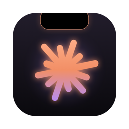
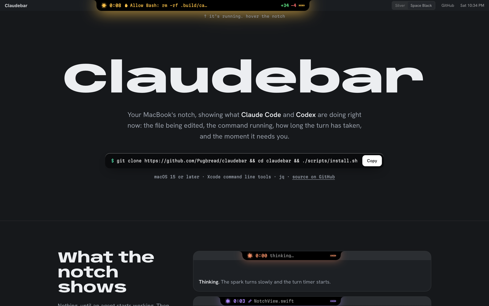
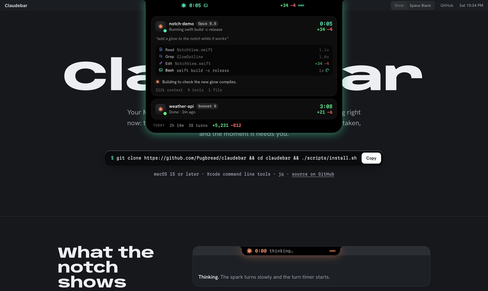

<p align="center">
  
</p>

<h1 align="center">Claudebar</h1>

<p align="center">
  Claude Code and Codex, live in your MacBook's notch.<br>
  <a href="https://pugbread.github.io/claudebar/"><b>Website</b></a> ·
  <a href="#install">Install</a> ·
  <a href="#how-it-works">How it works</a>
</p>

<p align="center">
  
</p>

When an agent is working, the notch grows ears: a spinning spark, the turn timer, what it's
doing right now (`✎ NotchView.swift`, `$ swift build`), and a running `+added −removed` line
count. It glows in the color of the current tool, pulses amber when the agent is waiting on
you, and bursts green when a turn finishes. Hover it for the full picture: every session, its
prompt, a live tool log, the last thing the agent said, context size, and today's totals.

<p align="center">
  
</p>

Works with every Claude Code surface that reads `~/.claude/settings.json` (the CLI, the IDE
extensions, and the Code tab in the Claude desktop app) and with Codex (CLI and desktop) through
`~/.codex/hooks.json`. Claude sessions spin a coral 12-ray spark; Codex sessions show the
OpenAI knot in Codex blue, read from your installed Codex app. On displays without a notch it
floats as an island at the top of the menu bar.

## Install

```bash
git clone https://github.com/Pugbread/claudebar
cd claudebar
./scripts/install.sh
```

This builds `Claudebar.app` into `~/Applications`, copies the hook script to
`~/.claude/hooks/claudebar-hook.sh`, registers it for the events below in Claude Code's
`settings.json` and Codex's `hooks.json` (keeping every other hook you have, with a
`.claudebar-backup` of each file), and launches it. It starts at login from then on.

Requires macOS 15 or later, the Xcode command line tools (`xcode-select --install`) and `jq`
(`brew install jq`). It builds on your Mac, so there's no unsigned download for Gatekeeper to block.

**Codex needs one extra step:** it only runs hooks you've reviewed. Open Codex, run `/hooks`,
and trust the Claudebar ones.

If Codex reviews approvals itself (`approvals_reviewer = "guardian_subagent"` in
`~/.codex/config.toml`), its permission requests show as *reviewing* on the command instead of
an amber "needs you", since Codex decides them without asking you.

`./scripts/uninstall.sh` removes the hooks, the hook script and the app.

## Using it

| State | Looks like |
|---|---|
| Thinking | the spark turns slowly, `thinking…` |
| Running a tool | spark spins up, tool icon + target, glow in the tool's color |
| Needs you (permission, question, plan) | amber pulse, jelly wobble, `✋ Allow Bash: …`, a soft *tink* |
| Done | green check with a spark burst, final time and line count, *glass* chime on long turns |
| Compacting | indigo spark, level meter rolling like a wave |
| Several sessions | a count badge; the bar follows whichever needs attention |

Rest the pointer inside the notch to expand it; it stays out of the way otherwise. Move over
either side of the bar and that side slides into the notch, so the menu bar under it is
reachable. Click a session card to jump to its app. Right-click (or use the gear) for Sounds,
Glow, Compact bar (icon only, for crowded menu bars), Show on all displays, Launch at login,
and **Play demo**.

**Media shelf.** Images and videos an agent touches show up as thumbnails at the top of the
expanded panel: files it reads or writes, paths in commands it runs (`ffmpeg … out.mp4`,
`plt.savefig("chart.png")`), images MCP tools return inline (renders, screenshots), and images
Codex generates. Hover one to see it big (videos play muted on a loop), click to open it,
drag it into another app to drop a copy of the file there, right-click to show it in Finder or
take it off the shelf. The last 30 are kept.

Sounds only play when the session's app isn't already in front.

## How it works

```
Claude Code / Codex ──hook (async)──▶ claudebar-hook.sh ──HTTP POST──▶ Claudebar.app (127.0.0.1:47823)
                                                                              │
                                                    transcript .jsonl ◀── tail │ (tokens, interrupts)
```

- **Hooks, not polling.** Each event runs `hooks/claudebar-hook.sh` as an `async` hook, so
  the agent never waits on it. The script pipes the JSON payload to the app with `curl`. If
  the app isn't running the connection is refused instantly and nothing happens.
- **Events used:** `SessionStart/End`, `UserPromptSubmit`, `Pre/PostToolUse(Failure)`,
  `PermissionRequest/Denied`, `Notification`, `Elicitation(Result)`, `Subagent Start/Stop`,
  `Pre/PostCompact`, `MessageDisplay` (streams Claude's text), `Stop`, `StopFailure`.
  Codex sends the same core set plus `Interrupt`; its hook command sets `CLAUDEBAR_AGENT=codex`.
- **Line counts** come from the `structuredPatch` in Edit/Write responses (falling back to a
  line diff of the tool input), and from the patch itself for Codex's `apply_patch`.
- **Token counts** come from tailing the session transcript (only new bytes are read). Codex
  records the model's context window, so its cards show usage like `215k / 258k`.
- **Chat titles** come from the transcript (Claude) or `~/.codex/session_index.jsonl` (Codex),
  so cards say what the session is about, not just the folder.
- **Which app to focus:** the hook forwards `__CFBundleIdentifier`, so clicking a session
  brings the right app forward: Claude desktop, Codex, iTerm, VS Code, Ghostty, and so on.
- **Dead sessions** are dropped when their `claude`/`codex` process exits, even without `SessionEnd`.
- **Restarts don't blank it:** sessions are saved to `~/Library/Application Support/Claudebar/`
  and restored on launch. A turn that finished while Claudebar was down is caught from its transcript.
- **Cheap to leave running:** the spark, glow and meter are Core Animation layer animations
  driven by the render server, so the bar costs about 5% of one core while an agent works and
  nothing when idle. Only the island on the display your pointer is on animates.

It listens on loopback only, needs no Accessibility or Screen Recording access, and only
displays things. It never answers a permission prompt.

## Debugging

```bash
curl -s localhost:47823/state | jq    # what Claudebar knows right now
curl -s localhost:47823/events | jq   # the last 300 raw hook events it received
curl -X POST localhost:47823/demo     # play the demo sequence
curl -X POST localhost:47823/peek     # pop the panel open for 8 seconds
```

Set `CLAUDEBAR_PORT` in both the app's and the agent's environment to change the port.

## Layout

```
Sources/Claudebar/
  App/       entry point, window + server wiring
  Server/    loopback HTTP server, hook payload envelope
  Model/     sessions, the event state machine, diff counting, transcript tailing
  UI/        notch window, the island, the expanded panel, animated components
hooks/       the forwarding hook script
scripts/     build / install / uninstall / icon generation
docs/        the website (GitHub Pages)
```

## License

MIT. Not affiliated with Anthropic or OpenAI. Claude and Codex are trademarks of their owners.
